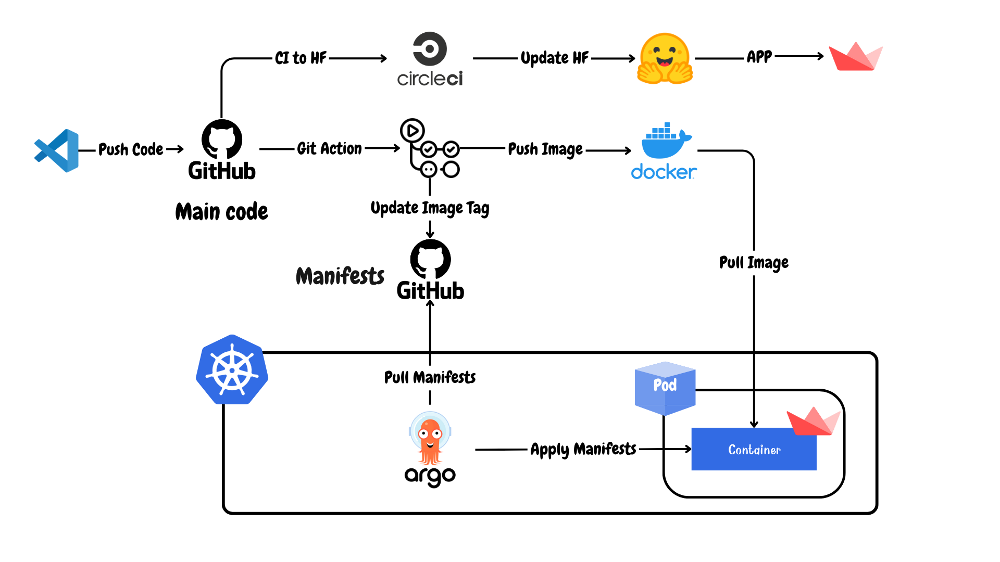
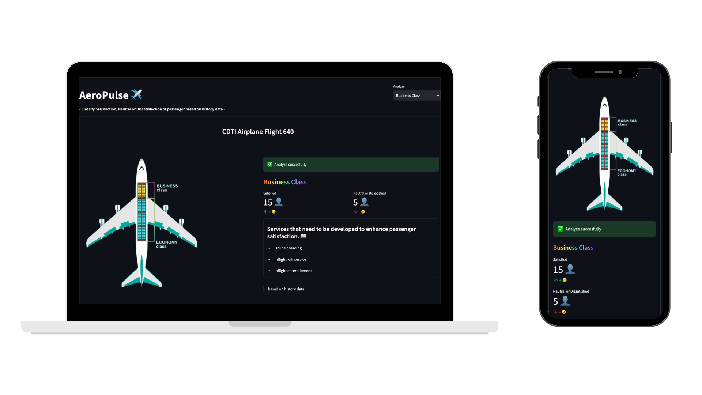

# AeroPulse ✈️

## <mark>Our Applications</mark> 🖥️

### CI/CD Deployment (no GoogleSheet API)

> Deployment Architecture



#### Application ⚡️

https://huggingface.co/spaces/Thanabodin/aeropulse-final

- Main code: https://github.com/Thanabodin19/deploy-model 

- Manifasts: https://github.com/Thanabodin19/deploy-model-k8s 

### .......

### Hugging Face Space (with GoogleSheet API)

#### Application ⚡️
https://huggingface.co/spaces/Thanabodin/AeroPulse_Project

## <mark>User Interface</mark> 💄


Running the Docker Container:
After creating your Dockerfile, you can build and run the container:

## <mark>Business Understanding and Data Mining</mark> 🪢
- repository: https://github.com/MLol-3/AeroPulse

## <mark>How to run our app</mark> 🐳

1. Build the Docker image:

```bash
docker build -t aeropulse-app .
```

2. Run the Docker container:

```bash
docker run -p 7860:7860 -p 8000:8000 aeropulse-app
```
